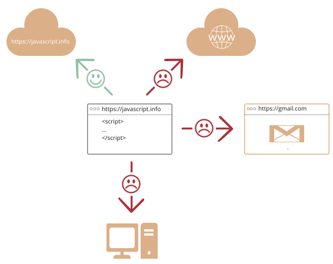

# JavaScript-ке кіріспе

JavaScript-тің ерекшелігі неде, онымен не нәрсеге қол жеткізуге болатынын және басқа қандай технологиялар онымен жақсы жұмыс істейтінін қарастырайық.

## JavaScript дегеніміз не?

*JavaScript* бастапқыда "веб-парақшаларды жандандыру" үшін жасалған.

Бұл тілдегі бағдарламалар *скрипттер* деп аталады. Оларды веб-парақшаның HTML-iне енгізуге болады және олар парақша жүктелген кезде автоматты түрде іске қосылады.

Скрипттер қарапайым мәтін түрінде беріледі және орындалады. Орындалу үшін оларға арнайы дайындық пен компиляция қажет емес.

Бұл тұрғыда JavaScript [Java](https://kk.wikipedia.org/wiki/Java_(бағдарламалау_тілі)) деп аталатын басқа тілден айтарлықтай ерекшеленеді.

```smart header="Неге ол <u>Java</u>Script деп аталады?"
JavaScript енді құрылып жатқанда "LiveScript" деп аталатын. Бірақ дәл сол кезде Java өте танымал болғандықтан, енді шығып келе жатқан тілді Java-ның "інісі" сияқты қылып таныстыра салған жөн деп шешім қабылданды.

Бірақ дамыған сайын JavaScript [ECMAScript](http://en.wikipedia.org/wiki/ECMAScript) деп аталатын өзіндік сипаттамасы бар толық тәуелсіз тілге айналды, енді оның Java-мен ешқандай байланысы жоқ.
```

Бүгінгі күні JavaScript браузерде ғана емес, сонымен қатар серверде де, [JavaScript қозғалтқышы](https://en.wikipedia.org/wiki/JavaScript_engine) деп аталатын арнайы бағдарламасы бар кез келген құрылғыда да орындала алады.
``
Браузердің өзінің қозғалтқышы бар, оны кейде «JavaScript виртуалды машинасы» деп атайды.

Әр түрлі қозғалтқыштарда әр түрлі «код атаулары» бар. Мысалы:

- [V8](https://en.wikipedia.org/wiki/V8_(JavaScript_engine)) -- Chrome, Opera мен Edge-те.
- [SpiderMonkey](https://en.wikipedia.org/wiki/SpiderMonkey) -- Firefox-та.
- ...IE үшін "Chakra", Safari үшін "JavaScriptCore", "Nitro" және "SquirrelFish" сияқты басқа да код атаулары бар.

Бұл атауларды есте сақтауға ​​пайдалы болады, себебі олар әзірлеушілердің мақалаларында жиі қолданылады. Біз оларды да қолданатын боламыз. Мысалы, егер "X функционалдылығы V8-пен қолдайтын болса", онда «X» Chrome, Opera мен Edge-те жұмыс істеуі ықтимал.

```smart header="Қозғалтқыштар қалай жұмыс істейді?"

Қозғалтқыштар құрылысы күрделі. Бірақ олардың негіздерін түсіну оңай.

1. (Веб шолғыш болса, Кірістірілген) қозғалтқыш скриптті оқиды ("талдайды").
2. Содан кейін ол скриптті машиналық тіліне түрлендіреді ("компиляциялайды").
3. Осыдан кейін машина коды іске қосылады және өте жылдам жұмыс істейді.

<<<<<<< HEAD
Қозғалтқыш процестің әр кезеңінде оңтайландыруды қолданады. Ол тіпті құрастырылған скрипттерді жұмыс кезінде бақылайды, ол арқылы өтетін деректерді талдайды және осы білімге сүйене отырып, машиналық кодын одан әрі оңтайландырады.
=======
1. The engine (embedded if it's a browser) reads ("parses") the script.
2. Then it converts ("compiles") the script to machine code.
3. And then the machine code runs, pretty fast.

The engine applies optimizations at each step of the process. It even watches the compiled script as it runs, analyzes the data that flows through it, and further optimizes the machine code based on that knowledge.
>>>>>>> 34a80e70f8cce5794be259d25f815d7a7db7cbe3
```

## JavaScript веб-шолғышта не істей алады?

<<<<<<< HEAD
Қазіргі JavaScript - бұл "қауіпсіз" бағдарламалау тілі. Ол жадқа немесе процессорға төменгі деңгейлік қолжетімділікке рұқсат бермейді, себебі ол бастапқыда оны қажет етпейтін веб-шолғыштарға үшін жасалған.
=======
Modern JavaScript is a "safe" programming language. It does not provide low-level access to memory or the CPU, because it was initially created for browsers which do not require it.
>>>>>>> 34a80e70f8cce5794be259d25f815d7a7db7cbe3

JavaScript мүмкіндіктері жұмыс істейтін ортаға тәуелді. Мысалы, [Node.js](https://wikipedia.org/wiki/Node.js) JavaScript-ке кездейсоқ файлдарды оқуға/жазуға, желілік сұраныстарды орындауға мүмкіндік беретін функцияларды қолдайды. т.б.

Браузердегі JavaScript веб-парақшаны манипуляциялауға, қолданушымен өзара әрекеттеуне және веб-серверге байланысты барлық нәрселерді жасай алады.

Мысалы, веб-шолғыштағы JavaScript келесі әрекеттерді орындай алады:

- Парақшаға жаңа HTML қосу, бар мазмұнды өзгерту, стильдерді өзгерту.
- Пайдаланушының әрекеттеріне, тінтуір шерутлеріне, көрсеткіш қозғалуына және перне басылуына жауап беру.
- Қашықтағы серверлерге желі арқылы сұратымдарды жіберу, файлдарды жүктеу және жіберу ([AJAX](https://kk.wikipedia.org/wiki/Ajax) және [COMET](https://en.wikipedia.org/wiki/Comet_(programming)) деп аталатын технологиялар).
- Кукилерді алу және орнату, келушіге сұрақтар қою, хабарламаларды көрсету.
- Клиент жағындағы деректерді есте сақтау ("local storage").

## JavaScript веб шолғышта не істей алмайды?

<<<<<<< HEAD
JavaScript-тің браузердегі мүмкіндіктері пайдаланушының қауіпсіздігі үшін шектелген. Бұның мақсаты зұлым веб-парақшаға жеке ақпаратқа қол жеткізуіне немесе пайдаланушының деректеріне зиян келтіруіне жол бермеу.
=======
JavaScript's abilities in the browser are limited to protect the user's safety. The aim is to prevent an evil webpage from accessing private information or harming the user's data.
>>>>>>> 34a80e70f8cce5794be259d25f815d7a7db7cbe3

Мұндай шектеулердің мысалдары мыналарды қамтиды:

- Веб-парақшадағы JavaScript қатқыл дисктегі кездейсоқ файлдарды оқи алмайды/жаза алмайды, оларды көшіре алмайды немесе бағдарламаларды орындай алмайды. Оның ОЖ функцияларына тікелей қолжеткімділігі жоқ.

    Қазіргі веб шолғыштар оған файлдармен жұмыс істеуге мүмкіндік береді, бірақ қолжеткімділік шектеулі және тек пайдаланушы белгілі бір әрекеттерді орындаса ғана қамтамасыз етіледі, мысалы, файлды веб шолғыш терезесіне "тастау" немесе оны `<input>` тег арқылы таңдау.

<<<<<<< HEAD
    Камерамен/микрофонмен және басқа құрылғылармен өзара әрекеттесу әдістері бар, бірақ олар пайдаланушының нақты рұқсатын қажет етеді. JavaScript қосылған парақша жасырынып веб-камераны қосуға, айналаны бақылауға және ақпаратты [ҰҚК-ға](https://kk.wikipedia.org/wiki/Қазақстан_Республикасы_Ұлттық_Қауіпсіздік_Комитеті) жібере алмайды.
- Әр түрлі қойындылар/терезелер әдетте бір-бірін туралы білмейді. Кейде ғана біледі, мысалы, бір терезе JavaScript қолданып екінші терезені ашады. Бірақ бұл жағдайда да, егер олар әр түрлі сайттардан (басқа доменнен, хаттамадан немесе порттан) келсе, бір парақшадағы JavaScript басқа парақшаға қол жеткізе алмайды.

    Бұл "Бірдей дереккөз саясаты" (Same Origin Policy) деп аталады. Бұл мәселені шешу үшін *парақшалардың екеуі* мәліметтер алмасуға келісуі керек және оны өңдейтін арнайы JavaScript коды болуы керек. Біз мұны оқулықта қарастырамыз.

    Бұл шектеу тағы да пайдаланушының қауіпсіздігі үшін қажет. Пайдаланушы ашқан `http://anysite.com` сайты басқа шолғыш қойындысына `http://gmail.com` URL мекенжайы бар парақшаға кіре алмауы керек және сол жерден ақпаратты ұрлай алмауы керек.
- JavaScript қазіргі парақша шыққан серверге желі арқылы оңай хабарласа алады. Бірақ оның басқа сайттардан/домендерден мәлімет алу мүмкіндігі шектелген. Мүмкін болса да, ол қашықты жақтан нақты келісімді (HTTP тақырыптарында көрсетілген) талап етеді. Тағы да, бұл қауіпсіздікке арналған шектеулері.



Егер JavaScript веб шолғыштан тыс, мысалы серверде қолданылса, мұндай шектеулер қолданылмайды. Қазіргі веб шолғыштар сонымен қатар кеңейтілген рұқсаттарды сұрайтын плагиндерге/кеңейтімдерге рұқсат береді.
=======
    There are ways to interact with the camera/microphone and other devices, but they require a user's explicit permission. So a JavaScript-enabled page may not sneakily enable a web-camera, observe the surroundings and send the information to the [NSA](https://en.wikipedia.org/wiki/National_Security_Agency).
- Different tabs/windows generally do not know about each other. Sometimes they do, for example when one window uses JavaScript to open the other one. But even in this case, JavaScript from one page may not access the other page if they come from different sites (from a different domain, protocol or port).

    This is called the "Same Origin Policy". To work around that, *both pages* must agree for data exchange and must contain special JavaScript code that handles it. We'll cover that in the tutorial.

    This limitation is, again, for the user's safety. A page from `http://anysite.com` which a user has opened must not be able to access another browser tab with the URL `http://gmail.com`, for example, and steal information from there.
- JavaScript can easily communicate over the net to the server where the current page came from. But its ability to receive data from other sites/domains is crippled. Though possible, it requires explicit agreement (expressed in HTTP headers) from the remote side. Once again, that's a safety limitation.


Such limitations do not exist if JavaScript is used outside of the browser, for example on a server. Modern browsers also allow plugins/extensions which may ask for extended permissions.
>>>>>>> 34a80e70f8cce5794be259d25f815d7a7db7cbe3

## JavaScript-ті бірегей ететін не?

JavaScript туралы кемінде *үш* керемет нәрсе бар:

```compare
+ HTML/CSS-пен толық интеграция.
+ Қарапайым нәрселер қарапайым түрде жасалады.
+ Барлық негізгі веб шолғыштар оны колдайды және әдепкі бойынша қосады.
```
JavaScript - бұл үш нәрсені біріктіретін жалғыз веб шолғыш технологиясы.

Бұл JavaScript-ті бірегей етеді. Сондықтан бұл веб шолғыш интерфейстерді құруға ең кең таралған құралы.

<<<<<<< HEAD
Сонымен қатар, JavaScript серверлерді, мобильді қосымшаларды және т.б. жасауға колданылады.
=======
That said, JavaScript can be used to create servers, mobile applications, etc.
>>>>>>> 34a80e70f8cce5794be259d25f815d7a7db7cbe3

## JavaScript-тен «жоғары» тілдері

JavaScript-тің синтаксисі әркімнің қажеттілігіне сәйкес келмейді. Әр түрлі адамдар әр түрлі ерекшеліктерді қалайды.

Мұны күтуге болады, өйткені жобалар мен талаптар әркім үшін әр түрлі.

<<<<<<< HEAD
Жақында веб шолғышта іске қосылмай тұрып JavaScript-ке *транспиляцияланған* (аударылатын) көптеген жаңа тілдер пайда болды.
=======
So, recently a plethora of new languages appeared, which are *transpiled* (converted) to JavaScript before they run in the browser.
>>>>>>> 34a80e70f8cce5794be259d25f815d7a7db7cbe3

Қазіргі заманғы құралдар транспиляцияны өте жылдам және мөлдір етеді, бұл әзірлеушілерге басқа тілде код жасауға мүмкіндік береді және оны "қақпақ астында" автоматты түрде аударады.

Мұндай тілдердің мысалдары:

<<<<<<< HEAD
- [CoffeeScript](http://coffeescript.org/) - бұл JavaScript үшін «синтаксистік қант». Ол ықшамды және нақты код жазуға мүмкіндік беретін қысқа синтаксисті енгізеді. Әдетте, бұл Ruby әзірлеушілерге ұнайды.
- [TypeScript](http://www.typescriptlang.org/) күрделі жүйелердің дамуы мен қолдауын жеңілдету үшін "деректердің қатаң тұрпаттарын" қосуға шоғырланған. Оны Microsoft әзірледі.
- [Flow](http://flow.org/) сонымен қатар деректердің тұрпаттарын қосады, бірақ басқаша. Оны Facebook әзірледі.
- [Dart](https://www.dartlang.org/) веб шолғышсыз ортада (мобильді қосымшалар сияқты) жұмыс істейтін жеке қозғалтқышы бар автономды тіл, бірақ оны JavaScript-ке көшіруге болады. Оны Google әзірледі.
- [Brython](https://brython.info/) JavaScript-ке арналған Python транспиляторы, ол қосымшаларды JavaScript-сіз таза Python-да жазуға мүмкіндік береді.
- [Kotlin](https://kotlinlang.org/docs/reference/js-overview.html) веб шолғышқа немесе Node-қа бағытталған заманауи, қысқа және қауіпсіз бағдарламалау тілі.

Одан әрі басқалар да бар. Әрине, егер біз аударылған тілдердің бірін қолдансақ та, біз не істеп жатқанымызды түсіну үшін JavaScript-ті білуіміз керек.
=======
- [CoffeeScript](https://coffeescript.org/) is "syntactic sugar" for JavaScript. It introduces shorter syntax, allowing us to write clearer and more precise code. Usually, Ruby devs like it.
- [TypeScript](https://www.typescriptlang.org/) is concentrated on adding "strict data typing" to simplify the development and support of complex systems. It is developed by Microsoft.
- [Flow](https://flow.org/) also adds data typing, but in a different way. Developed by Facebook.
- [Dart](https://www.dartlang.org/) is a standalone language that has its own engine that runs in non-browser environments (like mobile apps), but also can be transpiled to JavaScript. Developed by Google.
- [Brython](https://brython.info/) is a Python transpiler to JavaScript that enables the writing of applications in pure Python without JavaScript.
- [Kotlin](https://kotlinlang.org/docs/reference/js-overview.html) is a modern, concise and safe programming language that can target the browser or Node.

There are more. Of course, even if we use one of these transpiled languages, we should also know JavaScript to really understand what we're doing.
>>>>>>> 34a80e70f8cce5794be259d25f815d7a7db7cbe3

## Қорытынды

- JavaScript бастапқыда тек веб шолғышқа арналған тіл ретінде құрылды, бірақ қазір ол көптеген басқа орталарда қолданылады.
- Бүгінгі таңда JavaScript HTML/CSS-те толық интеграцияланған веб шолғыштың ең кең таралған тілі ретінде бірегей орынға ие.
- JavaScript-ке "аударылатын" және белгілі бір мүмкіндіктерді беретін көптеген тілдер бар. JavaScript-ті меңгергеннен кейін оларға қысқаша болса да қарауға ұсынылады.

